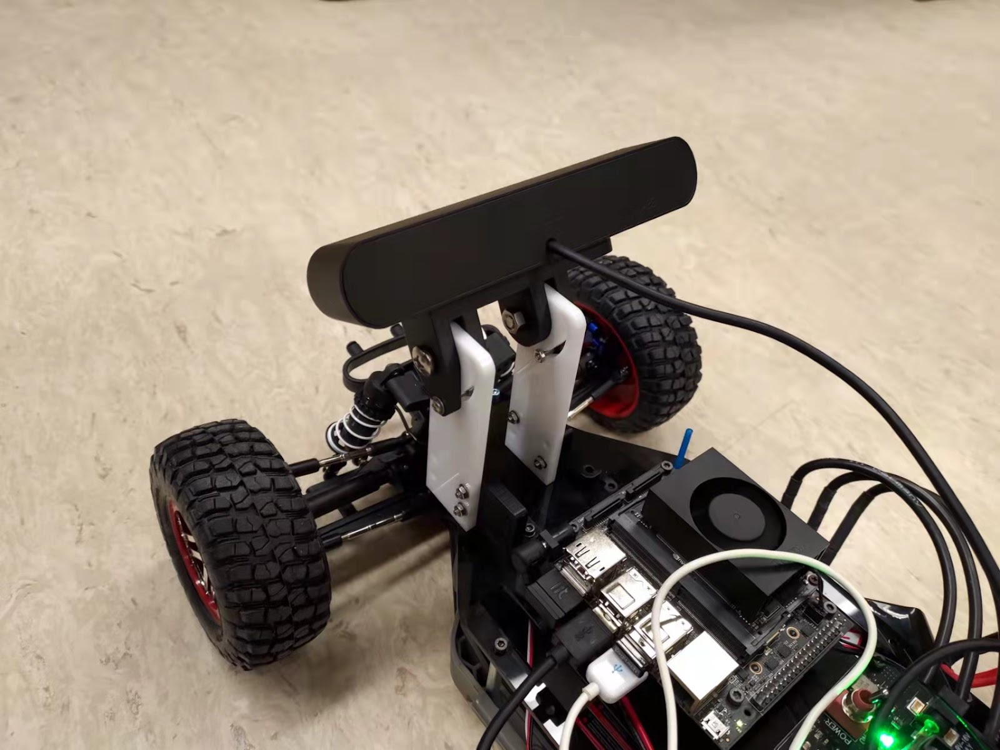
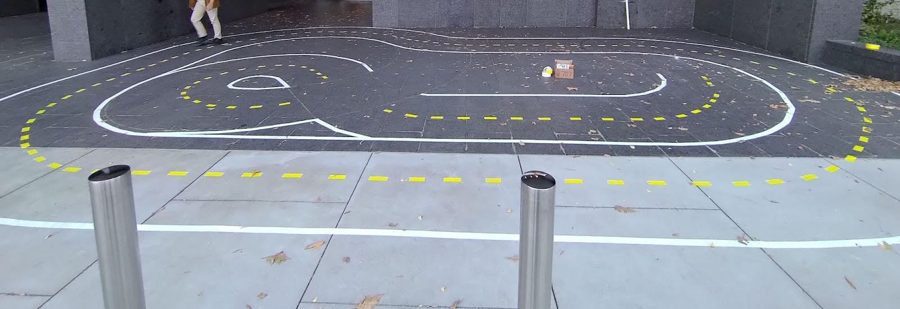
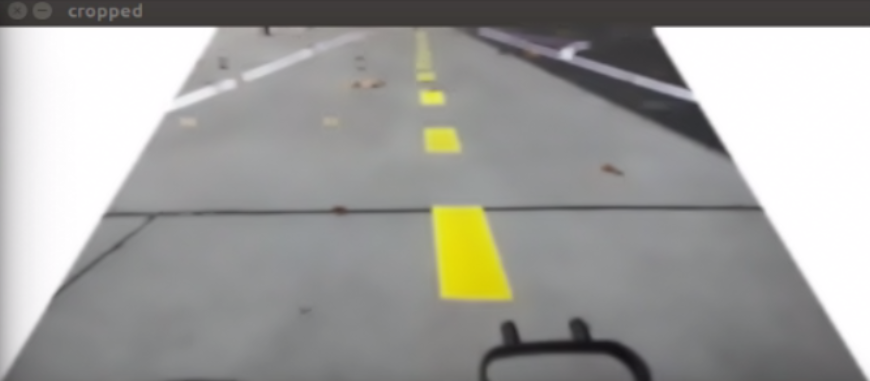
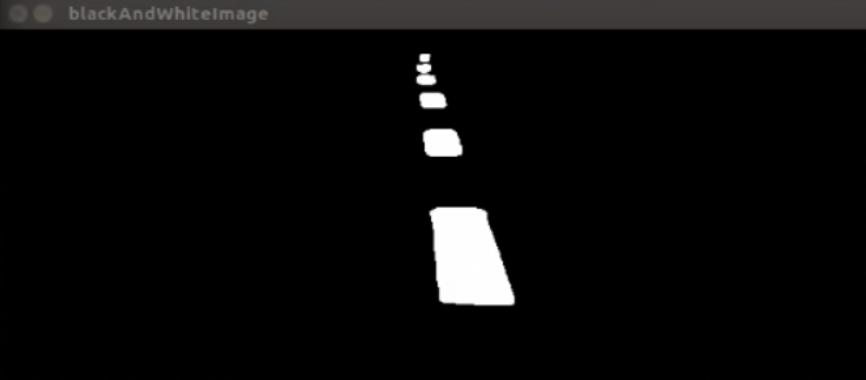
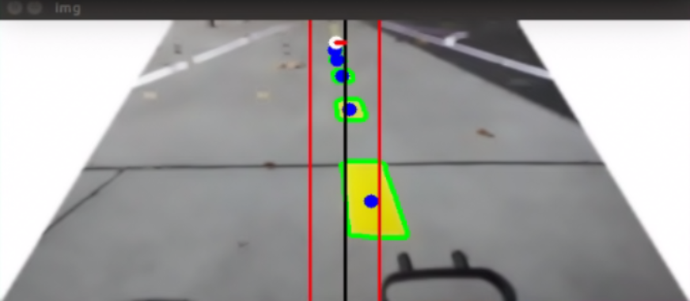
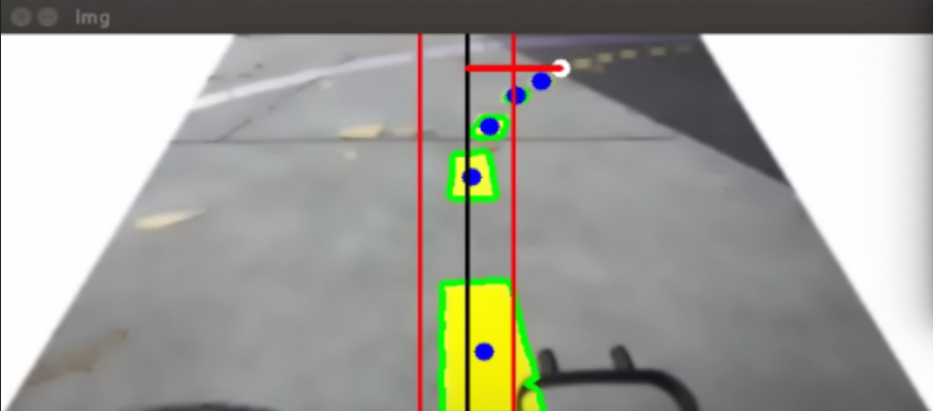
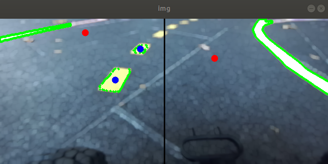
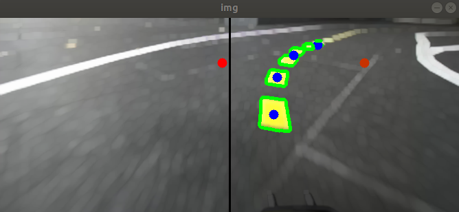
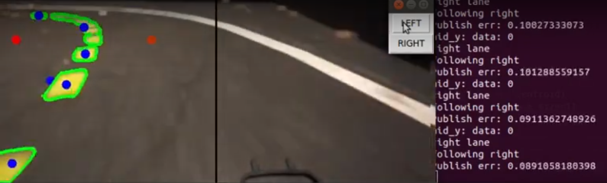
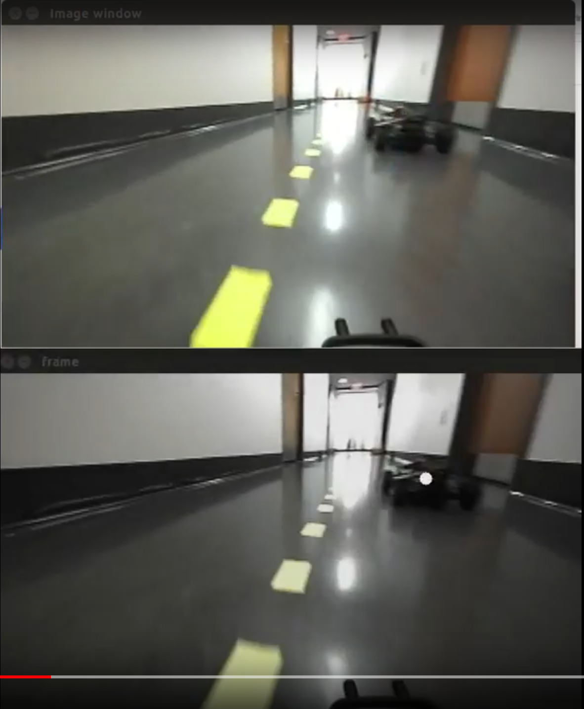

# F1TENTH Autonomous Racing using Monocular Camera

## Table of Contents

  - [**Overview**](#overview)
  - [**Setup**](#setup)
    - [Racecar Setup](#racecar_setup)
    - [Track Layout](#track_layout)
  - [**Individual Components**](#individual-components)
    - [Line Detection](#line-detection)
    - [Lane Waypoint Generation](#lane-waypoint-generation)
    - [Lane Following and Switching Control](#lane-following-and-switching-control)
    - [Racecar Detection with YOLO](#racecar-detection-with-yolo)
    - [Racecar Position Estimation](#racecar-position-estimation)
    - [Overtaking Maneuver](#overtaking-maneuver)
  - [**Demo**](#demo)
    - [Lane following](#lane-following)
    - [Lane Switching](#lane-switching)
    - [Overtaking](#overtaking)
    - [Going forward without overtaking](#going-forward-withou-overtaking)
  - [**Future Development and Recommendations**](#future-development-and-recommendations)

## Overview

The project includes development of classic CV and learning-based perception algorithms for high-speed racing maneuvers on real F1Tenth vehicles.

Previously, F1Tenth racecar systems relied on the Lidar for navigation and did not have a vision-based navigation suite. This project develops the vision-based nav suite and employ it for situation awareness in high-speed racing scenarios. Using the vision information from a monocular camera, the package is able to make the racecar follow a designated lane using classic image processing techniques and switch lanes with either use input or racecar detection results. To detect other racecars in front of the ego racecar, we deploy a YOLO network using TensorRT, and estimate the other racecar's relative position and relative speed with respect to the ego racecar using the prior knowledge of the height. Combining the lane following and switching module and the racecar detection and position estimation module, we can make the racecar perform simple overtaking maneuver when there is another racecar right in front of the ego racecar within the same lane.

## Setup

### Racecar Setup
The racecar utilized in this project is based on the F1Tenth racecar system, utilizing the same chassis and computer, the Jetson Xavier NX. The normally equipped LiDAR however, is replaced with a forward facing camera mounted at the front of the vehicle. The specific camera used in this project is the ZED 2 - AI Stereo Camera. This camera was chosen due to a combination of factors, including camera availability and ease of use. However, the project can be easily adapted for use with any monocular camera, as the capabilities of the ZED 2 camera were limited in our use cases to 30 fps at 672x376 on a singular camera (left).

The camera is installed on a laser cut mount that screws into the chassis of the racecar. It is located at the front of the robot, positioned 3.5 inches above the top platform of the chassis and at a 22 degree downward pitch angle. The CAD files for this mount can be found [here](media/CAD).

After assembly, the camera mount looks like:

The onboard Jetson Xavier NX is running on JetPack 4.6 and ROS Melodic.

### Track Layout
The track used in this project for the racecar to test in was based on a design used by races run by Jack Silberman's group at UCSD. The schematic for this track is provided [here](media/track_schematic.png).

The first iteration of the track followed closely to the schematic provided by Jack Silberman's group. However, due to physical limitations in the maximum turning radius of our F1Tenth racecars, we modified the track to eliminate the sharper turns that the racecars could not make during manual control. After adjustments, the track (shown below) is now oval shaped, with additional bends incorporated (ignore remnants of previous track in center).

## Individual Components

### Line Detection

Associated file: **line_detection.py**

The line detection node is used to detect the center yellow line seen on the track using classic image processing methods. After detection, the node outputs a waypoint centered on the yellow line for the racecar to follow using the waypoint following node.

The image processing steps and OpenCV methods utilized are as follows:
1. Image cropping to limit image to region of interest (lower portion of frame)
2. Gaussian Blur
3. Erosion
4. Dilation

After this step, the image looks as follows:

5. HSV Filter (Yellow)
6. Bitwise And
7. Threshold to black and white image

After these steps, the image frame is processed as a black and white image, in which the yellow center line markings are displayed in white and the background in black.

To prepare this black and white image to create waypoints, the OpenCV method findcontours is used to create (green) bounding contours around the lane markings. The moments of each contour is calculated and displayed as a (blue) circle on the image, representing the center of each contour. The furthest moment is chosen as the waypoint for the racecar to follow and is shown as a white circle. This allows the racecar to have a longer lookahead distance and respond better to curves and turns on the track.

Straight Track
 

Curved Track
 

The distance between this chosen moment and the center line of the image (representing the heading of the vehicle) is sent to the waypoint following node for control.

Note: The HSV bounds for filtering in step 5 will need to be tuned for different cameras and different lighting conditions. Results may vary depending on the values chosen for this filter.

### Lane Waypoint Generation

Associated file: **lane_detection_node.py**

The lane detection node is used to generate waypoints centered on both lanes of the track. While the line detection node outputs one waypoint based on the center yellow line, the lane detection node creates two possible waypoints for the racecar to follow, representing the two lanes on each side of the center line. Two methods were used to generate the lane waypoints.

The first method retains the center dashed line detection from the line detection node, but also expands to detection of the solid white lane boundaries on either side of the track. Much like detection for the center yellow line, classic image processing techniques are utilized to filter out the lane boundaries and create bounding contours around them. With bounding contours of the center dashed line and the flanking lane boundaries, two waypoints are generated by finding the average lateral position between the center line and each of the boundaries, and displayed as red circles on the image.

This method works well for an environment with consistent lighting conditions. However, as our track was located outdoors, the reflection of the sun off the surface of the ground would often create false positives for the white lane detection, especially in portions of the track where the racecar faces the sun. In addition, the presence of shade and shadows from surrounding structures due to the sun also affected the ability of the algorithm to correctly identify the lanes.

The second method is an extension of the line detection node and simply takes the center dashed line and extrapolates two waypoints to either side of the center line. While this method is more rudimentary, it is more robust to various lighting conditions as the yellow tape is easier to identify in our conditions than the white boundaries. Here, the lookahead distance is set at a fixed distance such that the waypoint is always shown at a fixed longitudinal position, while the lateral distance is calculated using the furthest and second furthest waypoints and a addition and subtraction by a fraction of the image width to get either side of the center line. The result is as follows:

### Lane Following and Switching Control

Associated files: **waypoint_follow.cpp, lane_detection_node.py**

After a waypoint is published by either the line detection or lane detection nodes to the /centroid topic, the waypoint follow node takes the waypoint and outputs an AckermannDrive message for the racecar to follow. The control algorithm is similar to that of Pure Pursuit control. Assuming that the waypoints that are published by line/lane detection are at a constant lookahead distance, the controller for steering angle is simply P control, where the input is the distance between the center of the robot and the waypoint.

As the lane detection node continuously generates two waypoints for each of the two lanes, lane switching is only a matter of selecting which waypoint for the racecar to follow. A UI element opens whenever **lane_detection_node.py** starts, allowing for manual selection of which lane for the racecar to be in. Selecting either the right or left lane will change the waypoint error that is published to the /centroid topic that the waypoint follow node uses for control.

Left/Right UI Control
 

### Racecar Detection with YOLO

### Racecar Position Estimation

### Overtaking Maneuver

Associated files: **lane_detection_node.py**

The lane detection node is subscribed to the /racecar_position topic published by **racecar_pose_estimate.py**, which publishes the  position of other racecars in the camera frame relative to the ego vehicle. For static obstacles, to determine whether or not to perform a lane switch maneuver, a rectangular region is defined in front of the racecar where if any other obstacle or vehicle is detected in it, the racecar will switch lanes and overtake. To switch lanes, the algorithm chooses the other of the two waypoints identified by the lane detection module and outputs the result to the waypoint following node. For dynamic obstacles (e.g. another racecar driving on the track), the algorithm will only switch lanes if the detected obstacle is in the defined rectangular region and also has a relative speed lower than a specified threshold.

After deciding to make a lane change maneuver, there is a lockout period during which the the racecar cannot attempt to change lanes again. This is to prevent the racecar from deciding to swap lanes continuously while still in the process of moving to the other lane. In addition, after a specified amount of time after the lane change maneuver, the racecar will return to its original lane.

Racecar Overtaking to Left
 

In the image above, the ego racecar detects the other static racecar in front of it in the lane (represented by white circle) and decides to change to the left lane to overtake.

## Instructions for Using the Package

## Demo

### Lane following

### Lane Switching

### Overtaking

### Going forward without overtaking

## Future Development and Recommendations
