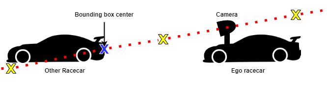

# F1TENTH Autonomous Racing using Monocular Camera

## Table of Contents

  - [**Overview**](#overview)
  - [**Individual Components**](#individual-components)
    - [Line Detection](#line-detection)
    - [Lane Waypoint Generation](#lane-waypoint-generation)
    - [Lane Following and Switching Control](#lane-following-and-switching-control)
    - [Racecar Detection with YOLO](#racecar-detection-with-yolo)
    - [Racecar Position Estimation](#racecar-position-estimation)
    - [Overtaking Maneuver](#overtaking-maneuver)
  - [**Demo**](#demo)
    - [Lane following](#lane-following)
    - [Lane Switching](#lane-switching)
    - [Racecar Detection and Relative Position Estimation](#racecar-detection-and-relative-position-estimation)
    - [Overtaking](#overtaking)
    - [Going forward without overtaking](#going-forward-withou-overtaking)
  - [**Future Development and Recommendations**](#future-development-and-recommendations)


## Overview

The project includes development of classic CV and learning-based perception algorithms for high-speed racing maneuvers on real F1Tenth vehicles. 

Previously, F1Tenth racecar systems relied on the Lidar for navigation and did not have a vision-based navigation suite. This project develops the vision-based nav suite and employ it for situation awareness in high-speed racing scenarios. Using the vision information from a monocular camera, the package is able to make the racecar follow a designated lane using classic image processing techniques and switch lanes with either use input or racecar detection results. To detect other racecars in front of the ego racecar, we deploy a YOLO network using TensorRT, and estimate the other racecar's relative position and relative speed with respect to the ego racecar using the prior knowledge of the height. Combining the lane following and switching module and the racecar detection and position estimation module, we can make the racecar perform simple overtaking maneuver when there is another racecar right in front of the ego racecar within the same lane.


## Individual Components

### Line Detection

### Lane Waypoint Generation

### Lane Following and Switching Control 

### Racecar Detection with YOLO
Associated files: **bbox_infer_node.cpp, bbox_infer_node.h, infer_process.cpp, infer_process.h, model_14_1.trt**

The original racecar detection package was written by Zirui Zang. We modified the code to fit our use case. The model we are currently using is a Fast YOLO network with 9 convolutional layers, and we deploy it with TensorRT to get the advantage of accelerated GPU programming. Since the model was trained using images taken indoor, it may not work reliably in the outdoor setting. Please see the following image for the pipeline of racecar detection (image courtesy of Zirui Zang).
<p align="center">

</p>

### Racecar Position Estimation
Associated file: **racecar_pose_estimate.py**

Estimating the 3D pose of an object using a single image from a monocular camera is not possible without any prior knowledge of the object. This is due to the scale ambiguity when we transform the coordinates from the pixel frame to the world frame. When we transform the pixel coordinates to the world frame without depth information, the resulted point can be at anywhere along the line connecting the camera origin and the correct point, as illustrated by the image below. The blue cross marks the actual detection bounding box center in the world frame, while yellow crosses are all the possible points we can get after transformation.
<p align="center">

</p>

In our case, we assume that the two racecars are on the same leveled floor, so we can use the prior knowledge of the height of the other racecar to estimate its position on a 2D plane. We define the origin of the world frame at the left rear wheel of the ego racecar with z up and y forward, and the position of the other racecar at the center of the back of the racecar, since the center of the bounding box produced by the detection module is mostly around that point. Since we know the two cars are on the same level, the z coordinate of the other racecar should be 0 w.r.t. the world frame. We can use the z coordinate to interpolate the x and y coordinates of the other racecar on the line as shown in the image above. The relative speed along each axis can also be calculated using the timestamps, but it's not currently being used for overtaking maneuver.

The position estimation error is evaluated using the ground truth racecar position measured by hand, which can be between 0.1 to 0.3 meters assuming the bounding box produced by the detection model is reasonable. The error mostly comes from the manual extrinsic calibration to find the transformation from the camera frame to the world frame and the manual measurement of ground truth positions. We considered using the depth information from ZED camera as the ground truth; however, the depth information produced by ZED API is too noisy and unreliable to serve as ground truth. 

### Overtaking Maneuver


## Instructions for Using the Package

### Pre-requisites
1. This package is only tested on Nvidia Jetson Xavier NX board with Jetpack 4.6
2. [ZED SDK](https://www.stereolabs.com/docs/installation/jetson/), [ZED ROS wrapper](https://github.com/stereolabs/zed-ros-wrapper) (if you are also using ZED camera)

### Common Steps
1. Clone the repository into a catkin workspace and build
```shell
$ cd ~/catkin_ws/src
$ git clone https://github.com/wenth1021/racecar_camera.git
$ cd ../
$ catkin_make
$ source ./devel/setup.bash
$ find . -name “*.py” -exec chmod +x {} \;
```

2. Launch the ZED ROS nodes
```shell
$ roslaunch zed_wrapper zed2.launch
```

### To run lane following and switching only
1. Run the lane detection node
```shell
$ rosrun racecar_camera lane_detection_node.py
```
2. Run the waypoint following node
```shell
$ rosrun racecar_camera waypoint_follow
```

### To run racecar detection and position estimation only
1. Run the racecar detection node
```shell
$ rosrun racecar_camera onnx_node
```
2. Run the position estimation node
```shell
$ rosrun racecar_camera racecar_pose_estimate.py
```

## Demo
Please click the images to see the videos.
### Lane following
[](http://www.youtube.com/watch?v=9chVtg-OG6I&list=PLkG99R12EVl58YCTZNS6t8nJl1Y91_RCd&index=2 "F1Tenth Racecar Lane Following")

### Lane Switching
[](http://www.youtube.com/watch?v=aDwI4A_th8c&list=PLkG99R12EVl58YCTZNS6t8nJl1Y91_RCd&index=3 "F1Tenth Racecar Lane Switching #1")
[](http://www.youtube.com/watch?v=OUIqxRfpbgI&list=PLkG99R12EVl58YCTZNS6t8nJl1Y91_RCd&index=4 "F1Tenth Racecar Lane Switching #2")

### Racecar Detection and Relative Position Estimation
[](http://www.youtube.com/watch?v=UgmHyZv_5KI&list=PLkG99R12EVl58YCTZNS6t8nJl1Y91_RCd&index=1 "F1Tenth Racecar Detection and Relative Position Estimation")

### Overtaking
[](http://www.youtube.com/watch?v=RzejdeyGEFM&list=PLkG99R12EVl58YCTZNS6t8nJl1Y91_RCd&index=5 "F1Tenth Racecar Overtaking #1")
[](http://www.youtube.com/watch?v=JiLgpS6LCNQ&list=PLkG99R12EVl58YCTZNS6t8nJl1Y91_RCd&index=6 "F1Tenth Racecar Overtaking #2")

### Going forward without overtaking
[](http://www.youtube.com/watch?v=QXwajsEyNPg&list=PLkG99R12EVl58YCTZNS6t8nJl1Y91_RCd&index=7 "F1Tenth Racecar Overtaking #3")

## Future Development and Recommendations

To further increase the speed of the racecar for lane following and switching, the control algorithm can be improved. Currently, the control of the turning angle is only a proportional control w.r.t. the error from the lane detection algorithm. To make the traveling path smoother, the control algorithm can be changed to a PID control or a model predictive control. 

To improve the reliability of the overtaking maneuver, the accuracy of the racecar pose estimation should be improved. The two major factors that can influence the accuracy of the pose estimation are the detection bounding box location and extrinsic transformation from camera frame to world frame. There is much room for the improvement for the CNN model used for racecar detection. New model structures can be used for more accurate detection such as YOLOv3 and Mask RCNN. And more data can collected in both indoor and outdoor settings to retrain the model. To obtain a more accurate extrinsic transformation, a target-based extrinsic calibration can be performed such as using AprilTag.