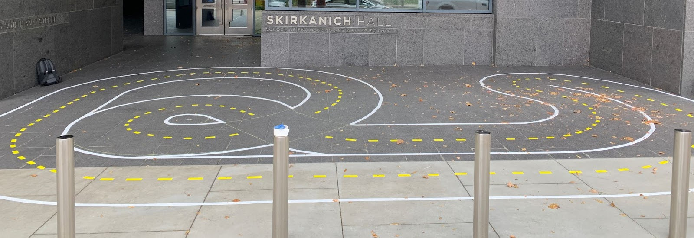

# F1TENTH Autonomous Racing using Monocular Camera

## Table of Contents

  - [**Overview**](#overview)
  - [**Setup**](#setup)
    - [Track Layout](#track_layout)
    - [Racecar Setup](#racecar_setup)
  - [**Individual Components**](#individual-components)
    - [Line Detection](#line-detection)
    - [Lane Waypoint Generation](#lane-waypoint-generation)
    - [Lane Following and Switching Control](#lane-following-and-switching-control)
    - [Racecar Detection with YOLO](#racecar-detection-with-yolo)
    - [Racecar Position Estimation](#racecar-position-estimation)
    - [Overtaking Maneuver](#overtaking-maneuver)
  - [**Demo**](#demo)
    - [Lane following](#lane-following)
    - [Lane Switching](#lane-switching)
    - [Overtaking](#overtaking)
    - [Going forward without overtaking](#going-forward-withou-overtaking)
  - [**Future Development and Recommendations**](#future-development-and-recommendations)

## Overview

The project includes development of classic CV and learning-based perception algorithms for high-speed racing maneuvers on real F1Tenth vehicles.

Previously, F1Tenth racecar systems relied on the Lidar for navigation and did not have a vision-based navigation suite. This project develops the vision-based nav suite and employ it for situation awareness in high-speed racing scenarios. Using the vision information from a monocular camera, the package is able to make the racecar follow a designated lane using classic image processing techniques and switch lanes with either use input or racecar detection results. To detect other racecars in front of the ego racecar, we deploy a YOLO network using TensorRT, and estimate the other racecar's relative position and relative speed with respect to the ego racecar using the prior knowledge of the height. Combining the lane following and switching module and the racecar detection and position estimation module, we can make the racecar perform simple overtaking maneuver when there is another racecar right in front of the ego racecar within the same lane.

## Setup

### Track Layout
The track used

### Racecar Setup
The racecar utilized in this project is based on the F1Tenth racecar system, utilizing the same chassis and computer, the Jetson Xavier NX. The normally equipped LiDAR however, is replaced with a forward facing camera mounted at the front of the vehicle. The specific camera used in this project is the ZED 2 - AI Stereo Camera. This camera was chosen due to a combination of factors, including camera availability and ease of use. However, the project can be easily adapted for use with any monocular camera, as the capabilities of the ZED 2 camera were limited in our use cases to 30 fps at 672x376 on a singular camera (left).

The camera is installed on a laser cut mount that screws into the chassis of the racecar. It is located at the front of the robot, positioned 3.5 inches above the top platform of the chassis and at a 22 degree downward pitch angle. The CAD files for this mount can be found here. ####ADD HYPERLINK

The onboard Jetson Xavier NX is running on JetPack 4.6 and ROS Melodic.

## Individual Components

### Line Detection

### Lane Waypoint Generation

### Lane Following and Switching Control

### Racecar Detection with YOLO

### Racecar Position Estimation

### Overtaking Maneuver

## Instructions for Using the Package

## Demo

### Lane following

### Lane Switching

### Overtaking

### Going forward without overtaking

## Future Development and Recommendations
